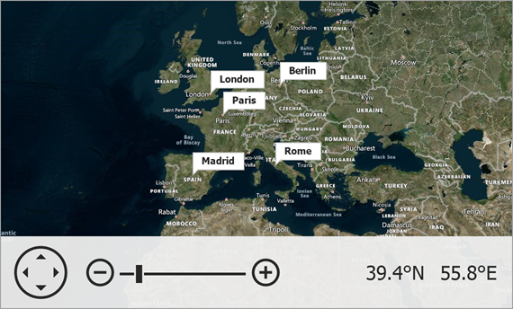

<!-- default badges list -->

<!-- default badges end -->

# Map for WinForms - Display Callouts on a Map

The following example shows how to create an array of five vector items ([map callouts](https://docs.devexpress.com/WindowsForms/DevExpress.XtraMap.MapCallout?p=netframework)) and display them on a map.

To do this, follow the steps below:

* Create a [`VectorItemsLayer`](https://docs.devexpress.com/WindowsForms/DevExpress.XtraMap.VectorItemsLayer?p=netframework) object and add it to the [`MapControl.Layers`](https://docs.devexpress.com/WindowsForms/DevExpress.XtraMap.MapControl.Layers?p=netframework) collection.

* Create a [`MapItemStorage`](https://docs.devexpress.com/WindowsForms/DevExpress.XtraMap.MapItemStorage?p=netframework) object and populate its [`Items`](https://docs.devexpress.com/WindowsForms/DevExpress.XtraMap.MapItemStorage.Items) collection with [`MapItem`](https://docs.devexpress.com/WindowsForms/DevExpress.XtraMap.MapItem) descendant objects. In this example, [`MapCallout`](https://docs.devexpress.com/WindowsForms/DevExpress.XtraMap.MapCallout) objects are added. Use the [`Text`](https://docs.devexpress.com/WindowsForms/DevExpress.XtraMap.MapPointer.Text) and [`Location`](https://docs.devexpress.com/WindowsForms/DevExpress.XtraMap.MapPointer.Location) properties to specify content and position for each callout.

* Assign the item storage to the vector layer's [`Data`](https://docs.devexpress.com/WindowsForms/DevExpress.XtraMap.VectorItemsLayer.Data?p=netframework) property.

* To create a background image layer with a geographical map, create an [`ImageLayer`](https://docs.devexpress.com/WindowsForms/DevExpress.XtraMap.ImageLayer?p=netframework), add it to the [`MapControl.Layers`](https://docs.devexpress.com/WindowsForms/DevExpress.XtraMap.MapControl.Layers?p=netframework) collection, and initialize the layer's [`DataProvider`](https://docs.devexpress.com/WindowsForms/DevExpress.XtraMap.ImageLayer.DataProvider) with an appropriate [image provider](https://docs.devexpress.com/WindowsForms/115774/controls-and-libraries/map-control/map-image-data/image-tile-providers?p=netframework) or [vector tile provider](https://docs.devexpress.com/WindowsForms/401639/controls-and-libraries/map-control/vector-data/providing-data/vector-tile-providers?p=netframework). This example uses the [`BingMapDataProvider`](https://docs.devexpress.com/WindowsForms/DevExpress.XtraMap.BingMapDataProvider?p=netframework).

## Files to Review

* [Form1.cs](./CS/Form1.cs) (VB: [Form1.vb](./VB/Form1.vb))

## Documentation

* [Vector Items](https://docs.devexpress.com/WindowsForms/15091/controls-and-libraries/map-control/vector-data/vector-items?p=netframework)

## More Examples

* [How to Create Different Map Shapes](https://github.com/DevExpress-Examples/winforms-map-create-different-map-shapes)
* [How to move a Map Pushpin element at runtime](https://github.com/DevExpress-Examples/how-to-move-a-map-pushpin-element-at-runtime-t190789)
* [How to manually provide vector items from WKT](https://github.com/DevExpress-Examples/how-to-manually-provide-vector-items-from-wkt-t222638)
* [How to manually generate map items for received GIS data](https://github.com/DevExpress-Examples/how-to-manually-generate-map-items-for-received-gis-data-t188443)
<!-- feedback -->
## Does this example address your development requirements/objectives?

 

(you will be redirected to DevExpress.com to submit your response)
<!-- feedback end -->
